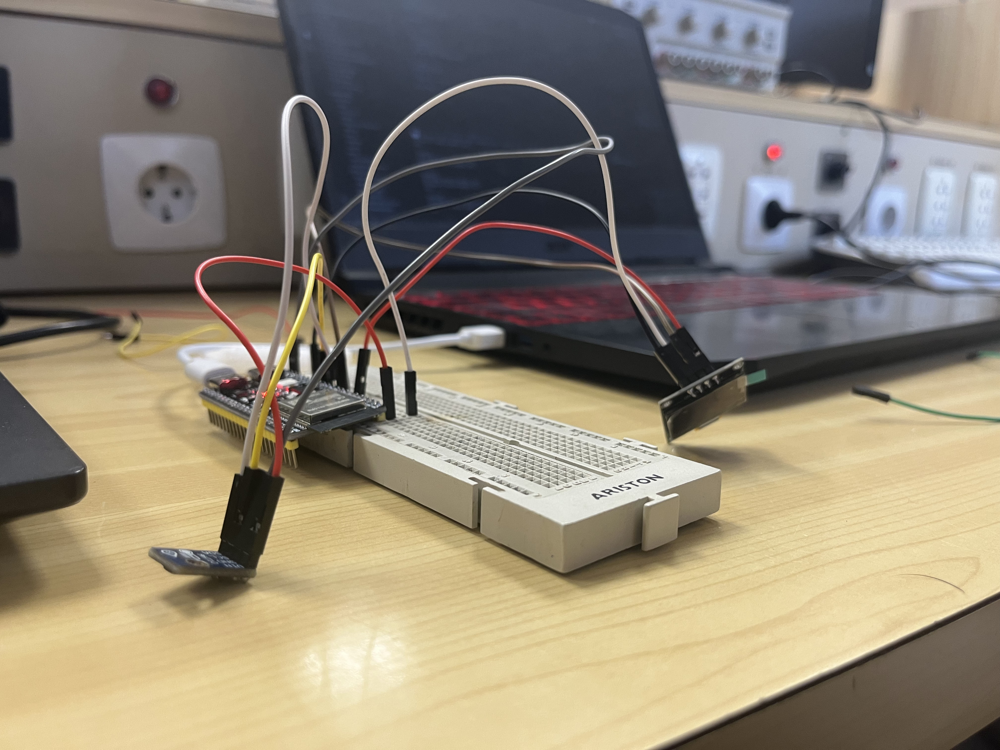
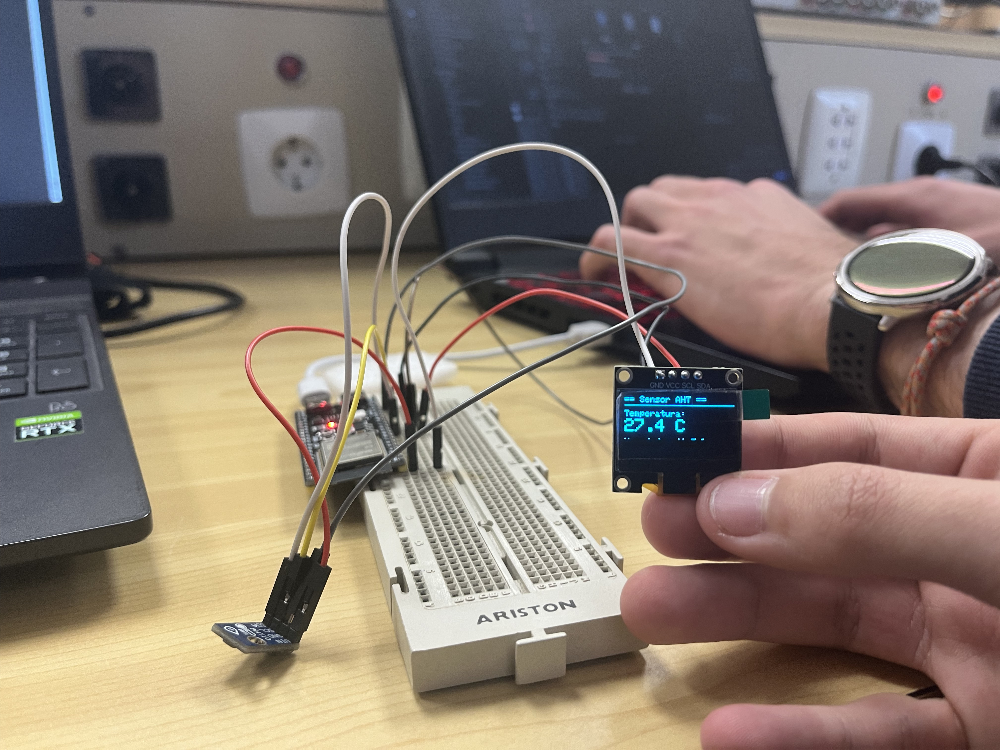
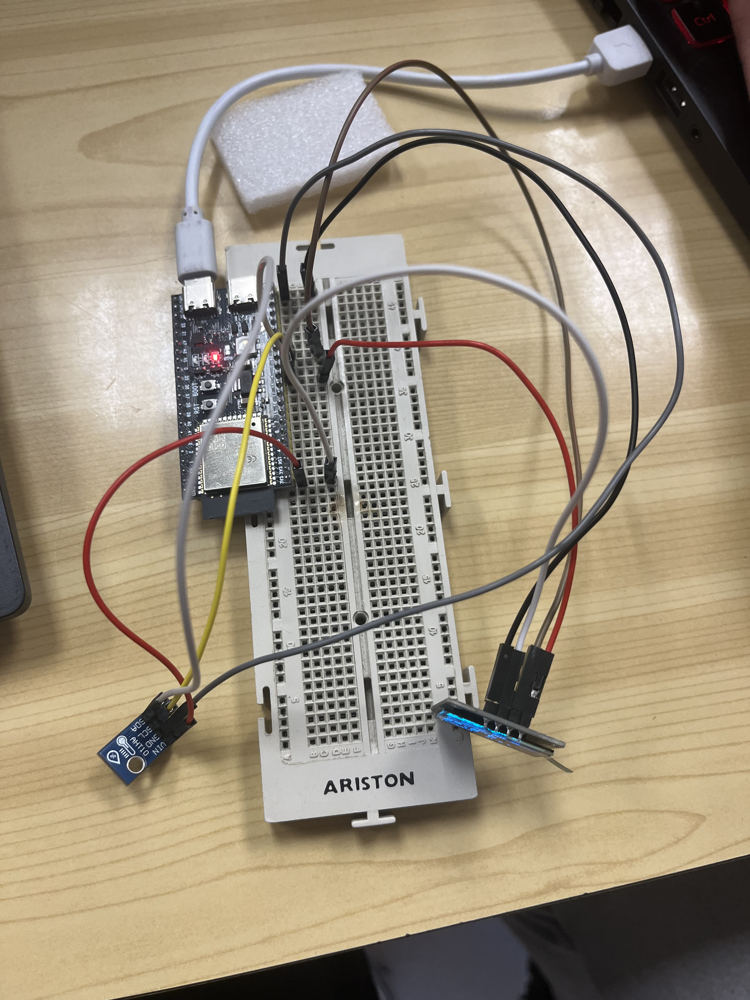

# 🌡️ Estación Meteorológica IoT - ESP32-S3 + AHT10/AHT20 + OLED + Web Server (Práctica 5)

[](https://platformio.org/)
[](https://www.arduino.cc/)
[](LICENSE)
[]()

Sistema completo de monitorización ambiental que combina un sensor de temperatura y humedad **AHT10/AHT20**, una pantalla **OLED SSD1306** y un **servidor web integrado** en modo Access Point (AP). Los datos se muestran simultáneamente en la pantalla física y en una elegante interfaz web responsive.

 <!-- Reemplazar por captura real -->



---

## 📋 Tabla de Contenidos

- [Características](#-características)
- [Requisitos de Hardware](#-requisitos-de-hardware)
- [Diagrama de Conexiones](#-diagrama-de-conexiones)
- [Arquitectura del Sistema](#-arquitectura-del-sistema)
- [Configuración del Software](#-configuración-del-software)
- [Estructura del Proyecto](#-estructura-del-proyecto)
- [Interfaz Web](#-interfaz-web)
- [Interfaz OLED](#-interfaz-oled)
- [API JSON](#-api-json)
- [Cómo Compilar y Cargar](#-cómo-compilar-y-cargar)
- [Guía de Uso](#-guía-de-uso)
- [Personalización](#-personalización)
- [Solución de Problemas](#-solución-de-problemas)
- [Posibles Mejoras](#-posibles-mejoras)
- [Licencia](#-licencia)

---

## ✨ Características

### Hardware
- **Sensor AHT10/AHT20**: medición precisa de temperatura y humedad.
- **Pantalla OLED SSD1306 128x64**: visualización local de datos e información WiFi.
- **ESP32-S3**: microcontrolador principal con WiFi integrado.
- **Actualización cada 2 segundos** en pantalla y puerto serie.

### Servidor Web (Modo Access Point)
- Crea una **red WiFi propia** sin necesidad de router externo.
- **Interfaz web responsive** con diseño moderno (modo oscuro, tarjetas).
- **Auto-refresco** automático cada 5 segundos (meta refresh).
- **Endpoint JSON** (`/json`) para integración con apps, Home Assistant, Node-RED, etc.
- Procesamiento de plantillas básico (reemplaza marcadores en HTML).

### Rendimiento
- Código **no bloqueante**: `server.handleClient()` se ejecuta constantemente.
- Lectura del sensor controlada por `millis()` sin usar `delay()`.
- HTML almacenado en **PROGMEM** para ahorrar RAM.

---

## 🛠️ Requisitos de Hardware

| Componente | Cantidad | Descripción |
| :--- | :---: | :--- |
| **ESP32-S3** | 1 | Placa de desarrollo RYMCU ESP32-S3 DevKitC-1 o similar. |
| **OLED SSD1306** | 1 | Pantalla I2C 0.96" 128x64 píxeles (dirección típica 0x3C). |
| **AHT10 o AHT20** | 1 | Sensor digital de temperatura y humedad I2C. |
| **Cables jumper** | 8 | Para conectar todos los componentes. |
| **Protoboard** | 1 | Para montaje organizado (opcional pero recomendado). |
| **Cable USB** | 1 | Para alimentación y programación. |

---

## 📐 Diagrama de Conexiones

Ambos dispositivos comparten el **mismo bus I2C** (pines SDA y SCL):

```
ESP32-S3           SSD1306 OLED        AHT10/AHT20
  3.3V ---------- VCC --------------- VIN
  GND  ---------- GND --------------- GND
  GPIO8 -------- SDA ---------------- SDA
  GPIO9 -------- SCL ---------------- SCL
```

**⚠️ Consideraciones importantes:**
- Ambos dispositivos deben funcionar a **3.3V**.
- Verifica que no haya conflicto de direcciones I2C:
  - OLED SSD1306: típicamente **0x3C** o 0x3D.
  - AHT10/AHT20: típicamente **0x38**.
- Si tienes problemas, usa el [I2C Scanner](https://github.com/bf-upc/Practica5_I2C_Scanner) para verificar las direcciones.

### Esquema Visual Simplificado

```
     ┌──────────────────────┐
     │      ESP32-S3        │
     │                      │
     │  3.3V ──┬── VCC_OLED │
     │         └── VIN_AHT  │
     │  GND  ──┬── GND_OLED │
     │         └── GND_AHT  │
     │  GPIO8 ──┬── SDA_OLED│
     │         └── SDA_AHT  │
     │  GPIO9 ──┬── SCL_OLED│
     │         └── SCL_AHT  │
     └──────────────────────┘
```

---

## 🏗️ Arquitectura del Sistema

```
┌─────────────────────────────────────────────┐
│                  ESP32-S3                   │
│                                             │
│  ┌─────────────┐  ┌──────────────────────┐ │
│  │   AHT10/20  │  │    SSD1306 OLED      │ │
│  │   (I2C)     │  │      (I2C)           │ │
│  └──────┬──────┘  └──────────┬───────────┘ │
│         │                    │              │
│         └────────┬───────────┘              │
│                  │ I2C Bus                 │
│         ┌────────▼───────────┐              │
│         │   Loop Principal   │              │
│         │  - Lee sensor (2s) │              │
│         │  - Actualiza OLED  │              │
│         │  - Sirve Web       │              │
│         └────────┬───────────┘              │
│                  │ WiFi AP                 │
│         ┌────────▼───────────┐              │
│         │  Servidor Web :80  │              │
│         │  - /     (HTML)    │              │
│         │  - /json (JSON)    │              │
│         └────────────────────┘              │
└──────────────────────┬──────────────────────┘
                       │ WiFi 2.4 GHz
        ┌──────────────┴──────────────┐
        │                             │
   ┌────▼────┐                  ┌────▼────┐
   │ Móvil / │                  │  PC /   │
   │ Tablet  │                  │ Laptop  │
   └─────────┘                  └─────────┘
```

---

## ⚙️ Configuración del Software

### Dependencias (PlatformIO)

```ini
[env:rymcu-esp32-s3-devkitc-1]
platform = espressif32
board = rymcu-esp32-s3-devkitc-1
framework = arduino
monitor_speed = 115200
lib_deps =
    adafruit/Adafruit SSD1306 @ ^2.5.16    ; Pantalla OLED
    adafruit/Adafruit GFX Library          ; Gráficos (dependencia de SSD1306)
    adafruit/Adafruit AHTX0               ; Sensor AHT10/AHT20
```

### Parámetros de Configuración Principales

| Parámetro | Valor por Defecto | Descripción |
| :--- | :--- | :--- |
| `AP_SSID` | `"ESP32-Sensor"` | Nombre de la red WiFi creada por el ESP32. |
| `AP_PASS` | `"12345678"` | Contraseña de la red WiFi (mínimo 8 caracteres). |
| `AP_IP` | `"192.168.4.1"` | Dirección IP del servidor web. |
| `OLED_ADDR` | `0x3C` | Dirección I2C de la pantalla OLED. |
| `SDA_PIN` | `8` | Pin SDA del bus I2C. |
| `SCL_PIN` | `9` | Pin SCL del bus I2C. |

---

## 🗂️ Estructura del Proyecto

```
Practica5_PantallaLed_TemperaturaHumidad_Web/
├── src/
│   └── main.cpp          # Código principal con toda la lógica
├── platformio.ini        # Configuración de PlatformIO
├── .gitignore            # Archivos ignorados por Git
└── README.md
```

---

## 🌐 Interfaz Web

### Página Principal (`/`)

Al conectarte desde un navegador a `http://192.168.4.1`, verás:

- **Diseño oscuro moderno** (fondo `#0f172a`, similar a Tailwind CSS dark mode).
- Dos **tarjetas** (cards) con iconos:
  - 🌡️ **Temperatura** en grados Celsius (color naranja).
  - 💧 **Humedad** relativa en porcentaje (color azul claro).
- **Auto-actualización** cada 5 segundos mediante `<meta http-equiv="refresh">`.
- Diseño **responsive** que se adapta a móviles y tablets.
- Pie de página con indicación de actualización automática.

### Características Técnicas del HTML

- **PROGMEM**: el HTML se almacena en memoria flash, no en RAM.
- **Raw String Literal** (`R"rawliteral(...)"`): permite escribir HTML multilínea sin escapar caracteres.
- **Placeholders**: `TEMP_VAL` y `HUM_VAL` se reemplazan dinámicamente con los valores del sensor.
- **CSS puro** sin dependencias externas ni JavaScript pesado.

---

## 📟 Interfaz OLED

La pantalla OLED muestra la siguiente información:

```
┌──────────────────────────────┐
│ ████████████████████████████ │ ← Cabecera blanca: "Sensor AHT"
│ Temp: 23.5 C                │ ← Temperatura en fuente grande
│                              │
│──────────────────────────────│ ← Línea separadora
│ Hum: 65.2 %                 │ ← Humedad en fuente normal
│ 192.168.4.1                 │ ← Dirección IP del servidor
└──────────────────────────────┘
```

### Secuencia de Inicio (4 segundos)

Al encender, muestra temporalmente:

```
┌──────────────────────────────┐
│ WiFi AP: ESP32-Sensor       │
│ Pass:    12345678           │
│ IP:      192.168.4.1        │
│                              │
│ Abre el navegador           │
│ y visita la IP!             │
└──────────────────────────────┘
```

---

## 🔌 API JSON

### Endpoint: `/json`

**Método:** GET  
**URL:** `http://192.168.4.1/json`  
**Respuesta:** JSON con los valores actuales del sensor.

**Ejemplo de respuesta:**
```json
{
  "temperatura": 23.5,
  "humedad": 65.2
}
```

**Casos de uso:**
- Integración con **Home Assistant** (sensor REST).
- **Node-RED** flows para IoT.
- Aplicaciones móviles mediante HTTP Client.
- Scripts Python/Bash para registro de datos.
- Dashboards personalizados (Grafana, etc.).

**Ejemplo con `curl`:**
```bash
curl http://192.168.4.1/json
```

**Ejemplo con Python:**
```python
import requests
response = requests.get("http://192.168.4.1/json")
data = response.json()
print(f"Temp: {data['temperatura']}°C, Hum: {data['humedad']}%")
```

---

## 🚀 Cómo Compilar y Cargar

1.  **Instala las herramientas:**
    - [Visual Studio Code](https://code.visualstudio.com/)
    - [Extensión PlatformIO](https://platformio.org/install/ide?install=vscode)

2.  **Clona el repositorio:**
    ```bash
    git clone https://github.com/bf-upc/Practica5_PantallaLed_TemperaturaHumidad_Web.git
    ```

3.  **Abre el proyecto:**
    - En VSCode, abre la carpeta del proyecto.
    - PlatformIO detectará el `platformio.ini` y descargará las librerías automáticamente.

4.  **Conecta el hardware:**
    - Realiza las conexiones según el diagrama.
    - Conecta el ESP32-S3 al PC mediante USB.

5.  **Compila y carga:**
    - Haz clic en el botón **Upload** (→) en la barra inferior de PlatformIO.
    - Espera a que termine la compilación y carga.

6.  **Monitoriza (opcional):**
    - Abre el Monitor Serie (botón del enchufe) a 115200 baudios.
    - Verás las lecturas del sensor en tiempo real.

---

## 📖 Guía de Uso

### Paso 1: Alimenta el ESP32-S3

Conecta el cable USB a una fuente de alimentación o al ordenador. La pantalla OLED se encenderá y mostrará la información de conexión durante 4 segundos.

### Paso 2: Conéctate a la red WiFi

1.  En tu móvil, tablet o PC, abre los ajustes de WiFi.
2.  Busca la red llamada **"ESP32-Sensor"**.
3.  Conéctate usando la contraseña: **"12345678"**.

### Paso 3: Accede a la interfaz web

1.  Abre tu navegador web favorito.
2.  Navega a: **`http://192.168.4.1`**
3.  Verás el dashboard con los valores actuales de temperatura y humedad.

### Paso 4: Visualiza los datos

- **Pantalla OLED**: muestra las lecturas actualizadas cada 2 segundos.
- **Página web**: se actualiza automáticamente cada 5 segundos.
- **Monitor serie**: muestra lecturas con timestamp relativo.
- **Endpoint JSON**: accede a `http://192.168.4.1/json` para datos estructurados.

---

## 🎨 Personalización

### Cambiar el nombre y contraseña WiFi

Modifica estas líneas en `main.cpp`:

```cpp
#define AP_SSID "Mi-Sensor-ESP32"     // Nombre de red personalizado
#define AP_PASS "m1_c0ntr4s3n4"      // Contraseña segura
```

### Cambiar intervalo de actualización

- **Pantalla OLED**: modifica `2000` en la línea:
  ```cpp
  if (millis() - lastRead >= 2000) {  // Cambia 2000 por otro valor
  ```
- **Página web**: cambia `content="5"` en el HTML:
  ```html
  <meta http-equiv="refresh" content="5">  <!-- Cambia 5 por otro valor -->
  ```

### Personalizar la interfaz web

El HTML está en `HTML_PAGE[] PROGMEM`. Puedes:
- Cambiar colores (variables CSS en la sección `<style>`).
- Modificar iconos (usa emojis Unicode o SVG).
- Añadir gráficas (Chart.js, Google Charts).
- Incluir JavaScript para actualizaciones AJAX sin refresco.

### Añadir más sensores al bus I2C

Si tu sensor tiene dirección diferente a 0x38, modifica la inicialización de la librería AHTX0 o usa otro sensor adicional respetando las direcciones I2C.

---

## 🔧 Solución de Problemas

### La pantalla OLED no muestra nada

| Posible Causa | Solución |
| :--- | :--- |
| Dirección I2C incorrecta | Prueba con 0x3D en lugar de 0x3C. Usa el I2C Scanner para verificar. |
| Conexiones sueltas | Revisa VCC, GND, SDA, SCL. |
| Pantalla dañada | Prueba con otra pantalla o con el ejemplo básico de Adafruit. |

### Error "Sensor AHT no encontrado"

| Posible Causa | Solución |
| :--- | :--- |
| Conexiones incorrectas | Verifica que el sensor está bien conectado al bus I2C. |
| Dirección I2C incorrecta | Algunos AHT20 usan 0x38, otros 0x39. Verifica con el escáner. |
| Alimentación insuficiente | Asegura 3.3V estables. |
| Módulo no compatible | La librería soporta AHT10, AHT20 y AHT21. Verifica tu modelo. |

### No aparece la red WiFi "ESP32-Sensor"

| Posible Causa | Solución |
| :--- | :--- |
| ESP32 no arranca | Presiona RST, verifica alimentación USB. |
| WiFi deshabilitada | Revisa que no haya errores de compilación. |
| Ocultación de redes | Busca manualmente la red. |

### La página web no carga

| Posible Causa | Solución |
| :--- | :--- |
| No conectado a la WiFi correcta | Conéctate a "ESP32-Sensor". |
| IP incorrecta | Siempre es `192.168.4.1` en modo AP. |
| Navegador cacheando | Usa modo incógnito o limpia caché. |
| Puerto incorrecto | Usa `http://` no `https://`, puerto 80 por defecto. |

### Lecturas erráticas del sensor

- El AHT necesita **tiempo de estabilización** (>1 segundo entre lecturas).
- Evita fuentes de calor cercanas al sensor.
- No toques el sensor con los dedos durante las mediciones.
- Verifica que no haya interferencias electromagnéticas.

---

## 💡 Posibles Mejoras

### Inmediatas
- [ ] Añadir **modo cliente WiFi** (STA) además de AP para conectar a red doméstica.
- [ ] Implementar **mDNS** (ej: `http://esp32-sensor.local`).
- [ ] Usar **WebSockets** en lugar de meta refresh para actualizaciones instantáneas.
- [ ] Añadir **gráficas históricas** con Chart.js o similar.

### IoT Avanzado
- [ ] Enviar datos a **MQTT** (Mosquitto, AWS IoT, etc.).
- [ ] Integrar con **Home Assistant** vía MQTT Auto Discovery.
- [ ] Subir datos a la nube (**ThingSpeak**, **Blynk**, **Firebase**).
- [ ] Implementar **OTA** (actualizaciones por WiFi).
- [ ] Añadir **registro en microSD** para almacenamiento local.

### Interfaz
- [ ] Página web con **AJAX** para actualización asíncrona.
- [ ] **Dashboard configurable** (elegir entre °C/°F, temas claro/oscuro).
- [ ] **Gráfica en tiempo real** con canvas o SVG.
- [ ] **Botones en web** para controlar LEDs o relés.

### Hardware
- [ ] Añadir **batería LiPo** con monitorización de carga.
- [ ] Modo **deep sleep** para bajo consumo.
- [ ] Integrar **pantalla TFT** más grande.
- [ ] Conectar más sensores (presión atmosférica, calidad de aire, luz).

---

## 📄 Licencia

Este proyecto se distribuye bajo la Licencia MIT. Consulta el archivo `LICENSE` para más detalles.

```
MIT License

Copyright (c) 2025 [Autor/Propietario del repo]

Permission is hereby granted, free of charge, to any person obtaining a copy
of this software and associated documentation files (the "Software"), to deal
in the Software without restriction, including without limitation the rights
to use, copy, modify, merge, publish, distribute, sublicense, and/or sell
copies of the Software, and to permit persons to whom the Software is
furnished to do so, subject to the following conditions:
...
```

---

## 📚 Recursos Adicionales

### Documentación Oficial
- [Adafruit SSD1306 Library](https://github.com/adafruit/Adafruit_SSD1306)
- [Adafruit GFX Library](https://github.com/adafruit/Adafruit-GFX-Library)
- [Adafruit AHTX0 Library](https://github.com/adafruit/Adafruit_AHTX0)
- [ESP32 WiFi API](https://docs.espressif.com/projects/arduino-esp32/en/latest/api/wifi.html)
- [ESP32 WebServer](https://github.com/espressif/arduino-esp32/tree/master/libraries/WebServer)

### Tutoriales Relacionados
- [I2C Scanner - Proyecto complementario](https://github.com/bf-upc/Practica5_I2C_Scanner)
- [OLED SSD1306 Demo - Todas las funciones gráficas](https://github.com/bf-upc/Practica5_I2C_LED_TEST)

---

⭐ **¿Te gustó este proyecto? ¡Dale una estrella en GitHub!** ⭐

---

